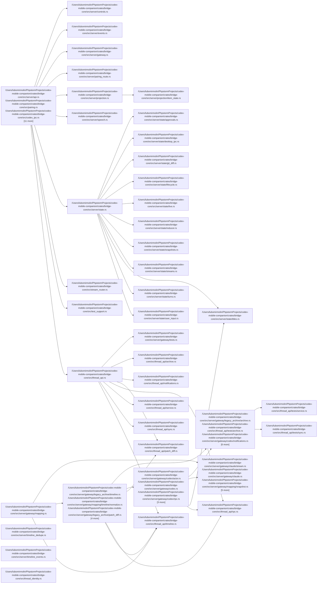

```mermaid
graph LR
  c0["/Users/lubomirmolin/PhpstormProjects/codex-mobile-companion/crates/bridge-core/src/server/gateway/legacy_archive/archive.rs
/Users/lubomirmolin/PhpstormProjects/codex-mobile-companion/crates/bridge-core/src/thread_api/tests/archive.rs
/Users/lubomirmolin/PhpstormProjects/codex-mobile-companion/crates/bridge-core/src/server/gateway/codex/notifications.rs
[6 more]"]
  c1["/Users/lubomirmolin/PhpstormProjects/codex-mobile-companion/crates/bridge-core/src/server/api.rs
/Users/lubomirmolin/PhpstormProjects/codex-mobile-companion/crates/bridge-core/src/pairing.rs
/Users/lubomirmolin/PhpstormProjects/codex-mobile-companion/crates/bridge-core/src/codex_ipc.rs
[11 more]"]
  c2["/Users/lubomirmolin/PhpstormProjects/codex-mobile-companion/crates/bridge-core/src/server/gateway/claude/stream.rs
/Users/lubomirmolin/PhpstormProjects/codex-mobile-companion/crates/bridge-core/src/server/gateway/claude.rs
/Users/lubomirmolin/PhpstormProjects/codex-mobile-companion/crates/bridge-core/src/server/gateway/mapping/snapshot.rs
[5 more]"]
  c3["/Users/lubomirmolin/PhpstormProjects/codex-mobile-companion/crates/bridge-core/src/server/gateway/codex/actor.rs
/Users/lubomirmolin/PhpstormProjects/codex-mobile-companion/crates/bridge-core/src/server/gateway/codex.rs
/Users/lubomirmolin/PhpstormProjects/codex-mobile-companion/crates/bridge-core/src/server/gateway/codex/rpc.rs
[3 more]"]
  c4["/Users/lubomirmolin/PhpstormProjects/codex-mobile-companion/crates/bridge-core/src/server/gateway/legacy_archive/timeline.rs
/Users/lubomirmolin/PhpstormProjects/codex-mobile-companion/crates/bridge-core/src/server/gateway/mapping/timeline/normalize.rs
/Users/lubomirmolin/PhpstormProjects/codex-mobile-companion/crates/bridge-core/src/server/gateway/legacy_archive/patch_diff.rs
[4 more]"]
  c5["/Users/lubomirmolin/PhpstormProjects/codex-mobile-companion/crates/bridge-core/src/server/controls.rs"]
  c6["/Users/lubomirmolin/PhpstormProjects/codex-mobile-companion/crates/bridge-core/src/server/events.rs"]
  c7["/Users/lubomirmolin/PhpstormProjects/codex-mobile-companion/crates/bridge-core/src/server/gateway.rs"]
  c8["/Users/lubomirmolin/PhpstormProjects/codex-mobile-companion/crates/bridge-core/src/server/gateway/mapping.rs"]
  c9["/Users/lubomirmolin/PhpstormProjects/codex-mobile-companion/crates/bridge-core/src/server/gateway/tests.rs"]
  c10["/Users/lubomirmolin/PhpstormProjects/codex-mobile-companion/crates/bridge-core/src/server/pairing_route.rs"]
  c11["/Users/lubomirmolin/PhpstormProjects/codex-mobile-companion/crates/bridge-core/src/server/projection.rs"]
  c12["/Users/lubomirmolin/PhpstormProjects/codex-mobile-companion/crates/bridge-core/src/server/projection/item_state.rs"]
  c13["/Users/lubomirmolin/PhpstormProjects/codex-mobile-companion/crates/bridge-core/src/server/speech.rs"]
  c14["/Users/lubomirmolin/PhpstormProjects/codex-mobile-companion/crates/bridge-core/src/server/state.rs"]
  c15["/Users/lubomirmolin/PhpstormProjects/codex-mobile-companion/crates/bridge-core/src/server/state/approvals.rs"]
  c16["/Users/lubomirmolin/PhpstormProjects/codex-mobile-companion/crates/bridge-core/src/server/state/desktop_ipc.rs"]
  c17["/Users/lubomirmolin/PhpstormProjects/codex-mobile-companion/crates/bridge-core/src/server/state/git_diff.rs"]
  c18["/Users/lubomirmolin/PhpstormProjects/codex-mobile-companion/crates/bridge-core/src/server/state/lifecycle.rs"]
  c19["/Users/lubomirmolin/PhpstormProjects/codex-mobile-companion/crates/bridge-core/src/server/state/live.rs"]
  c20["/Users/lubomirmolin/PhpstormProjects/codex-mobile-companion/crates/bridge-core/src/server/state/reducer.rs"]
  c21["/Users/lubomirmolin/PhpstormProjects/codex-mobile-companion/crates/bridge-core/src/server/state/snapshots.rs"]
  c22["/Users/lubomirmolin/PhpstormProjects/codex-mobile-companion/crates/bridge-core/src/server/state/streams.rs"]
  c23["/Users/lubomirmolin/PhpstormProjects/codex-mobile-companion/crates/bridge-core/src/server/state/titles.rs"]
  c24["/Users/lubomirmolin/PhpstormProjects/codex-mobile-companion/crates/bridge-core/src/server/state/turns.rs"]
  c25["/Users/lubomirmolin/PhpstormProjects/codex-mobile-companion/crates/bridge-core/src/server/state/user_input.rs"]
  c26["/Users/lubomirmolin/PhpstormProjects/codex-mobile-companion/crates/bridge-core/src/server/timeline_dedupe.rs"]
  c27["/Users/lubomirmolin/PhpstormProjects/codex-mobile-companion/crates/bridge-core/src/server/timeline_events.rs"]
  c28["/Users/lubomirmolin/PhpstormProjects/codex-mobile-companion/crates/bridge-core/src/thread_api/tests/service.rs"]
  c29["/Users/lubomirmolin/PhpstormProjects/codex-mobile-companion/crates/bridge-core/src/stream_router.rs"]
  c30["/Users/lubomirmolin/PhpstormProjects/codex-mobile-companion/crates/bridge-core/src/thread_api/tests/sync.rs"]
  c31["/Users/lubomirmolin/PhpstormProjects/codex-mobile-companion/crates/bridge-core/src/test_support.rs"]
  c32["/Users/lubomirmolin/PhpstormProjects/codex-mobile-companion/crates/bridge-core/src/thread_api.rs"]
  c33["/Users/lubomirmolin/PhpstormProjects/codex-mobile-companion/crates/bridge-core/src/thread_api/archive.rs"]
  c34["/Users/lubomirmolin/PhpstormProjects/codex-mobile-companion/crates/bridge-core/src/thread_api/notifications.rs"]
  c35["/Users/lubomirmolin/PhpstormProjects/codex-mobile-companion/crates/bridge-core/src/thread_api/patch_diff.rs"]
  c36["/Users/lubomirmolin/PhpstormProjects/codex-mobile-companion/crates/bridge-core/src/thread_api/rpc.rs"]
  c37["/Users/lubomirmolin/PhpstormProjects/codex-mobile-companion/crates/bridge-core/src/thread_api/service.rs"]
  c38["/Users/lubomirmolin/PhpstormProjects/codex-mobile-companion/crates/bridge-core/src/thread_api/sync.rs"]
  c39["/Users/lubomirmolin/PhpstormProjects/codex-mobile-companion/crates/bridge-core/src/thread_api/timeline.rs"]
  c40["/Users/lubomirmolin/PhpstormProjects/codex-mobile-companion/crates/bridge-core/src/thread_identity.rs"]
  c0 --> c28
  c0 --> c30
  c1 --> c5
  c1 --> c6
  c1 --> c7
  c1 --> c10
  c1 --> c11
  c1 --> c13
  c1 --> c14
  c1 --> c29
  c1 --> c31
  c1 --> c32
  c3 --> c0
  c3 --> c2
  c3 --> c23
  c3 --> c36
  c4 --> c0
  c4 --> c3
  c4 --> c35
  c4 --> c36
  c4 --> c39
  c8 --> c2
  c8 --> c4
  c8 --> c39
  c11 --> c12
  c14 --> c15
  c14 --> c16
  c14 --> c17
  c14 --> c18
  c14 --> c19
  c14 --> c20
  c14 --> c21
  c14 --> c22
  c14 --> c23
  c14 --> c24
  c14 --> c25
  c32 --> c9
  c32 --> c33
  c32 --> c34
  c32 --> c35
  c32 --> c36
  c32 --> c37
  c32 --> c38
  c32 --> c39
```
