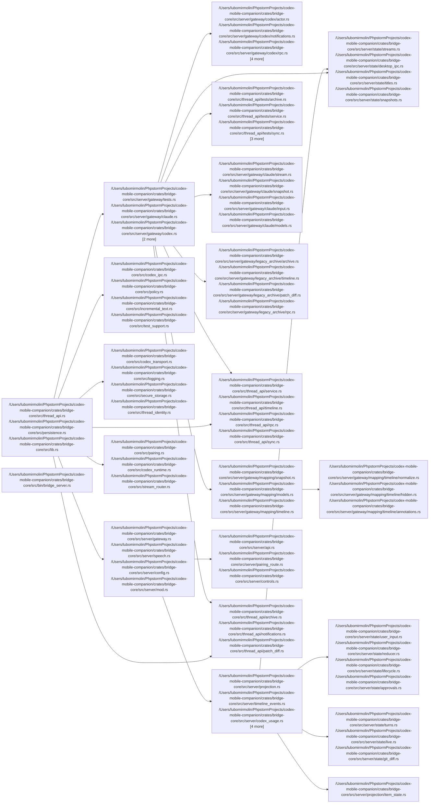

```mermaid
graph LR
  c0["/Users/lubomirmolin/PhpstormProjects/codex-mobile-companion/crates/bridge-core/src/server/gateway/codex/actor.rs
/Users/lubomirmolin/PhpstormProjects/codex-mobile-companion/crates/bridge-core/src/server/gateway/codex/notifications.rs
/Users/lubomirmolin/PhpstormProjects/codex-mobile-companion/crates/bridge-core/src/server/gateway/codex/rpc.rs
[4 more]"]
  c1["/Users/lubomirmolin/PhpstormProjects/codex-mobile-companion/crates/bridge-core/src/server/projection.rs
/Users/lubomirmolin/PhpstormProjects/codex-mobile-companion/crates/bridge-core/src/server/timeline_events.rs
/Users/lubomirmolin/PhpstormProjects/codex-mobile-companion/crates/bridge-core/src/server/codex_usage.rs
[4 more]"]
  c2["/Users/lubomirmolin/PhpstormProjects/codex-mobile-companion/crates/bridge-core/src/thread_api/tests/archive.rs
/Users/lubomirmolin/PhpstormProjects/codex-mobile-companion/crates/bridge-core/src/thread_api/tests/service.rs
/Users/lubomirmolin/PhpstormProjects/codex-mobile-companion/crates/bridge-core/src/thread_api/tests/sync.rs
[3 more]"]
  c3["/Users/lubomirmolin/PhpstormProjects/codex-mobile-companion/crates/bridge-core/src/server/gateway/tests.rs
/Users/lubomirmolin/PhpstormProjects/codex-mobile-companion/crates/bridge-core/src/server/gateway/claude.rs
/Users/lubomirmolin/PhpstormProjects/codex-mobile-companion/crates/bridge-core/src/server/gateway/codex.rs
[2 more]"]
  c4["/Users/lubomirmolin/PhpstormProjects/codex-mobile-companion/crates/bridge-core/src/codex_ipc.rs
/Users/lubomirmolin/PhpstormProjects/codex-mobile-companion/crates/bridge-core/src/policy.rs
/Users/lubomirmolin/PhpstormProjects/codex-mobile-companion/crates/bridge-core/src/incremental_text.rs
/Users/lubomirmolin/PhpstormProjects/codex-mobile-companion/crates/bridge-core/src/test_support.rs"]
  c5["/Users/lubomirmolin/PhpstormProjects/codex-mobile-companion/crates/bridge-core/src/codex_transport.rs
/Users/lubomirmolin/PhpstormProjects/codex-mobile-companion/crates/bridge-core/src/logging.rs
/Users/lubomirmolin/PhpstormProjects/codex-mobile-companion/crates/bridge-core/src/secure_storage.rs
/Users/lubomirmolin/PhpstormProjects/codex-mobile-companion/crates/bridge-core/src/thread_identity.rs"]
  c6["/Users/lubomirmolin/PhpstormProjects/codex-mobile-companion/crates/bridge-core/src/server/gateway/claude/stream.rs
/Users/lubomirmolin/PhpstormProjects/codex-mobile-companion/crates/bridge-core/src/server/gateway/claude/snapshot.rs
/Users/lubomirmolin/PhpstormProjects/codex-mobile-companion/crates/bridge-core/src/server/gateway/claude/input.rs
/Users/lubomirmolin/PhpstormProjects/codex-mobile-companion/crates/bridge-core/src/server/gateway/claude/models.rs"]
  c7["/Users/lubomirmolin/PhpstormProjects/codex-mobile-companion/crates/bridge-core/src/server/gateway/legacy_archive/archive.rs
/Users/lubomirmolin/PhpstormProjects/codex-mobile-companion/crates/bridge-core/src/server/gateway/legacy_archive/timeline.rs
/Users/lubomirmolin/PhpstormProjects/codex-mobile-companion/crates/bridge-core/src/server/gateway/legacy_archive/patch_diff.rs
/Users/lubomirmolin/PhpstormProjects/codex-mobile-companion/crates/bridge-core/src/server/gateway/legacy_archive/rpc.rs"]
  c8["/Users/lubomirmolin/PhpstormProjects/codex-mobile-companion/crates/bridge-core/src/server/gateway.rs
/Users/lubomirmolin/PhpstormProjects/codex-mobile-companion/crates/bridge-core/src/server/speech.rs
/Users/lubomirmolin/PhpstormProjects/codex-mobile-companion/crates/bridge-core/src/server/config.rs
/Users/lubomirmolin/PhpstormProjects/codex-mobile-companion/crates/bridge-core/src/server/mod.rs"]
  c9["/Users/lubomirmolin/PhpstormProjects/codex-mobile-companion/crates/bridge-core/src/server/state/user_input.rs
/Users/lubomirmolin/PhpstormProjects/codex-mobile-companion/crates/bridge-core/src/server/state/reducer.rs
/Users/lubomirmolin/PhpstormProjects/codex-mobile-companion/crates/bridge-core/src/server/state/lifecycle.rs
/Users/lubomirmolin/PhpstormProjects/codex-mobile-companion/crates/bridge-core/src/server/state/approvals.rs"]
  c10["/Users/lubomirmolin/PhpstormProjects/codex-mobile-companion/crates/bridge-core/src/server/state/streams.rs
/Users/lubomirmolin/PhpstormProjects/codex-mobile-companion/crates/bridge-core/src/server/state/desktop_ipc.rs
/Users/lubomirmolin/PhpstormProjects/codex-mobile-companion/crates/bridge-core/src/server/state/titles.rs
/Users/lubomirmolin/PhpstormProjects/codex-mobile-companion/crates/bridge-core/src/server/state/snapshots.rs"]
  c11["/Users/lubomirmolin/PhpstormProjects/codex-mobile-companion/crates/bridge-core/src/thread_api/service.rs
/Users/lubomirmolin/PhpstormProjects/codex-mobile-companion/crates/bridge-core/src/thread_api/timeline.rs
/Users/lubomirmolin/PhpstormProjects/codex-mobile-companion/crates/bridge-core/src/thread_api/rpc.rs
/Users/lubomirmolin/PhpstormProjects/codex-mobile-companion/crates/bridge-core/src/thread_api/sync.rs"]
  c12["/Users/lubomirmolin/PhpstormProjects/codex-mobile-companion/crates/bridge-core/src/pairing.rs
/Users/lubomirmolin/PhpstormProjects/codex-mobile-companion/crates/bridge-core/src/codex_runtime.rs
/Users/lubomirmolin/PhpstormProjects/codex-mobile-companion/crates/bridge-core/src/stream_router.rs"]
  c13["/Users/lubomirmolin/PhpstormProjects/codex-mobile-companion/crates/bridge-core/src/server/gateway/mapping/snapshot.rs
/Users/lubomirmolin/PhpstormProjects/codex-mobile-companion/crates/bridge-core/src/server/gateway/mapping/models.rs
/Users/lubomirmolin/PhpstormProjects/codex-mobile-companion/crates/bridge-core/src/server/gateway/mapping/timeline.rs"]
  c14["/Users/lubomirmolin/PhpstormProjects/codex-mobile-companion/crates/bridge-core/src/thread_api.rs
/Users/lubomirmolin/PhpstormProjects/codex-mobile-companion/crates/bridge-core/src/persistence.rs
/Users/lubomirmolin/PhpstormProjects/codex-mobile-companion/crates/bridge-core/src/lib.rs"]
  c15["/Users/lubomirmolin/PhpstormProjects/codex-mobile-companion/crates/bridge-core/src/server/gateway/mapping/timeline/normalize.rs
/Users/lubomirmolin/PhpstormProjects/codex-mobile-companion/crates/bridge-core/src/server/gateway/mapping/timeline/hidden.rs
/Users/lubomirmolin/PhpstormProjects/codex-mobile-companion/crates/bridge-core/src/server/gateway/mapping/timeline/annotations.rs"]
  c16["/Users/lubomirmolin/PhpstormProjects/codex-mobile-companion/crates/bridge-core/src/server/api.rs
/Users/lubomirmolin/PhpstormProjects/codex-mobile-companion/crates/bridge-core/src/server/pairing_route.rs
/Users/lubomirmolin/PhpstormProjects/codex-mobile-companion/crates/bridge-core/src/server/controls.rs"]
  c17["/Users/lubomirmolin/PhpstormProjects/codex-mobile-companion/crates/bridge-core/src/server/state/turns.rs
/Users/lubomirmolin/PhpstormProjects/codex-mobile-companion/crates/bridge-core/src/server/state/live.rs
/Users/lubomirmolin/PhpstormProjects/codex-mobile-companion/crates/bridge-core/src/server/state/git_diff.rs"]
  c18["/Users/lubomirmolin/PhpstormProjects/codex-mobile-companion/crates/bridge-core/src/thread_api/archive.rs
/Users/lubomirmolin/PhpstormProjects/codex-mobile-companion/crates/bridge-core/src/thread_api/notifications.rs
/Users/lubomirmolin/PhpstormProjects/codex-mobile-companion/crates/bridge-core/src/thread_api/patch_diff.rs"]
  c19["/Users/lubomirmolin/PhpstormProjects/codex-mobile-companion/crates/bridge-core/src/bin/bridge_server.rs"]
  c20["/Users/lubomirmolin/PhpstormProjects/codex-mobile-companion/crates/bridge-core/src/server/projection/item_state.rs"]
  c1 --> c9
  c1 --> c10
  c1 --> c17
  c1 --> c20
  c3 --> c0
  c3 --> c2
  c3 --> c6
  c3 --> c7
  c3 --> c10
  c3 --> c11
  c3 --> c13
  c3 --> c18
  c8 --> c1
  c8 --> c16
  c13 --> c15
  c14 --> c3
  c14 --> c4
  c14 --> c5
  c14 --> c8
  c14 --> c11
  c14 --> c12
  c14 --> c18
```
